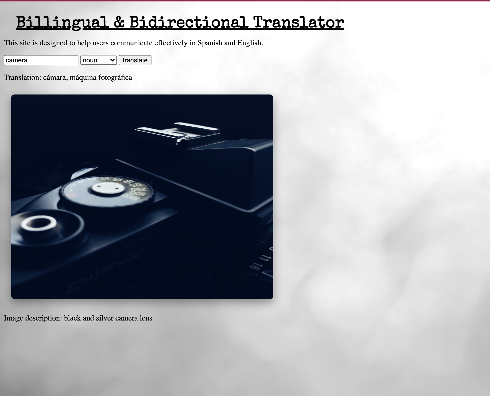

 📊 Project: Complex API 2

The website allows users to enter a word and it will translate then populate a picture so they can understand it better.

I completed the challenge: 5
I feel good about my code: 4

